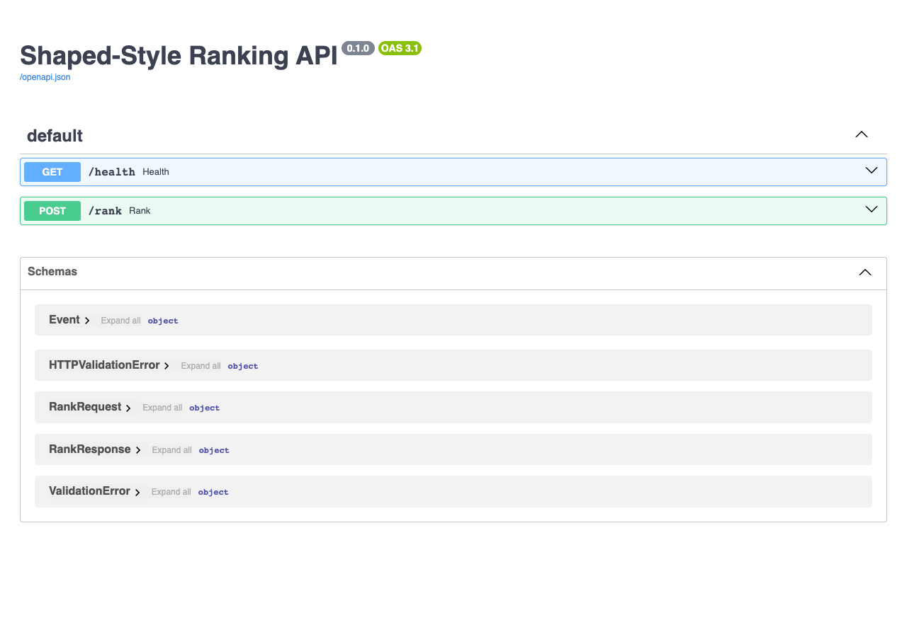
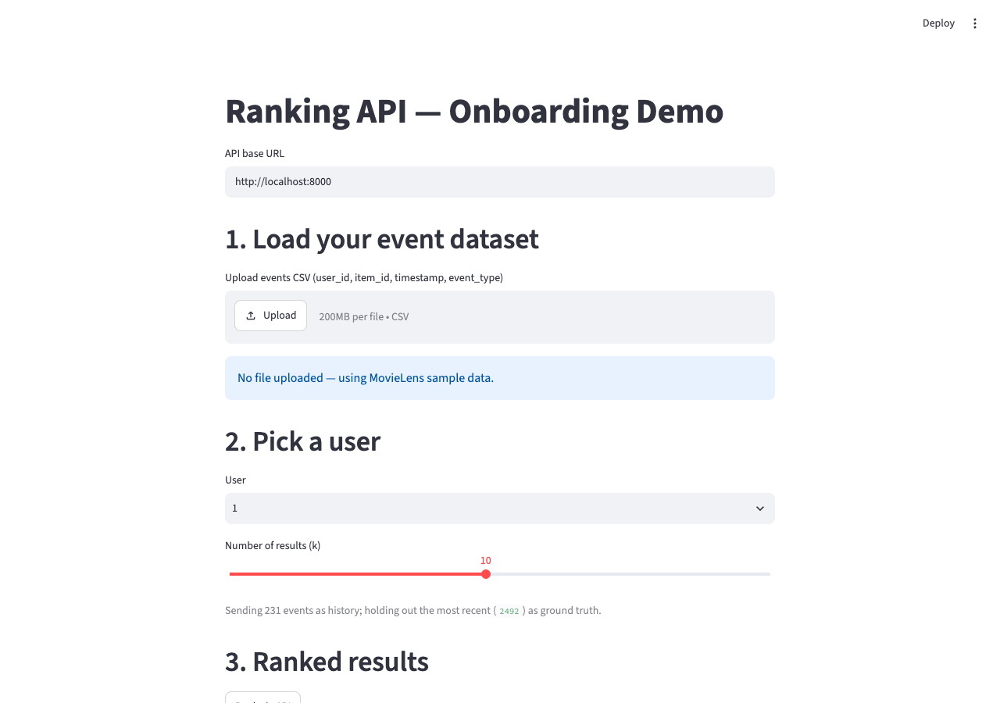
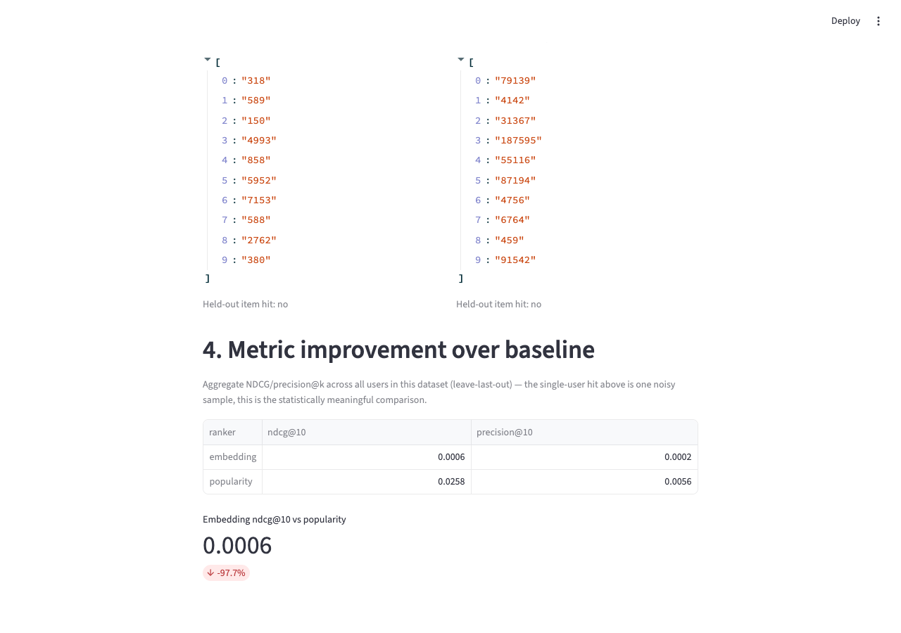

# shaped-style-ranking-api

A lightweight ranking-as-a-service API, mirroring the shape of a platform like
[Shaped](https://www.shaped.ai/): send a user's event history, get back a
ranked list of items. Includes a popularity baseline, a pre-trained-embedding
content ranker, an offline eval comparing them, and a demo UI.

## Screenshots

**FastAPI's auto-generated docs (`/docs`)** — the live API contract: the
`/health` check, the `/rank` endpoint, and the request/response schemas
(`Event`, `RankRequest`, `RankResponse`) generated straight from the
Pydantic models in `api/schemas.py` and `api/main.py`.



**Demo, step 1–2: load data and pick a user** — the onboarding flow starts
by loading an event dataset (MovieLens sample data here, or your own CSV
matching the schema) and picking which user to rank for. The app shows
exactly what it's about to send: 231 history events for user "1", with the
232nd (most recent) held out as ground truth for the metric step below.



**Demo, step 3–4: live ranked results and metric comparison** — clicking
"Rank via API" makes two real HTTP calls to the running `/rank` endpoint
(one per ranker) and shows the results side by side, plus whether the
held-out item was recovered. Below that is the aggregate NDCG@10/precision@10
comparison across all users, reusing the same `evaluate()` function as
`eval/run_eval.py` — this is what actually tells you which ranker is doing
better, not the single-user hit above it.



## Structure

- `api/` — FastAPI app. `schemas.py` defines the generic event schema
  (`user_id`, `item_id`, `timestamp`, `event_type`). `POST /rank` takes a list
  of events, returns ranked items.
- `models/` — `PopularityRanker` (frequency baseline), `EmbeddingRanker`
  (pre-trained GloVe word vectors averaged over each item's title/genres,
  ranked by cosine similarity to the user's history), and `movielens.py`
  (loads/caches the MovieLens `ml-latest-small` dataset — ~100k ratings —
  reshaped to the event schema).
- `eval/` — NDCG@10 / precision@10 comparison of the two rankers via
  leave-last-out evaluation on the real dataset.
- `demo/` — Streamlit onboarding flow: load an events CSV (or use MovieLens
  sample data), pick a user, hit the live `/rank` API for both rankers, and
  see ranked results plus the aggregate NDCG/precision@k comparison side by
  side. Requires the API running (see below).
- `reports/` — eval output lands in `eval_results.md`.

## Setup

```bash
python -m venv .venv && source .venv/bin/activate
pip install -r requirements.txt
```

First run downloads and caches the MovieLens dataset (`data/`, ~1MB) and the
pre-trained GloVe vectors (via `gensim`, ~66MB) — both cached locally after that.

## Run the API

```bash
uvicorn api.main:app --reload
```

```bash
curl -X POST localhost:8000/rank \
  -H "Content-Type: application/json" \
  -d '{"events": [{"user_id": "1", "item_id": "1", "timestamp": 0, "event_type": "like"}], "k": 5, "ranker": "embedding"}'
```

## Run the eval

```bash
python -m eval.run_eval
```

Prints average NDCG@10 / precision@10 per ranker and writes
`reports/eval_results.md`.

## Run the demo

Requires the API running in another terminal (`uvicorn api.main:app`), since
the demo calls `/rank` over HTTP rather than importing the rankers directly.

```bash
streamlit run demo/app.py
```

## Notes / what's skipped

- `EmbeddingRanker` is content-based (title/genres → pre-trained GloVe word
  vectors, averaged), not a learned collaborative-filtering model — no
  training step needed. On the leave-last-out eval it actually scores *lower*
  than the popularity baseline (see `reports/eval_results.md`): predicting the
  one exact movie a user rates next is a different target than recommending
  genre-similar movies, and popularity is a famously hard baseline to beat on
  exact-item recall. Spot-checking a user's recs (Toy Story, Heat, Braveheart
  → other Action/Adventure/Thriller titles) shows the ranker is working as
  intended — it's the eval question, not the ranker, that favors popularity.
  A collaborative-filtering signal (e.g. blending in the previous SVD-based
  approach) would likely close this gap; out of scope here since the ask was
  a single pre-trained embedding model.
- A custom CSV uploaded to the demo has no title/genre text, so the embedding
  ranker has nothing to embed for those items and returns no results —
  popularity still works since it only needs `item_id` counts.
- No auth, rate limiting, or persistence on the API — add if this needs to
  run as a real multi-tenant service.
